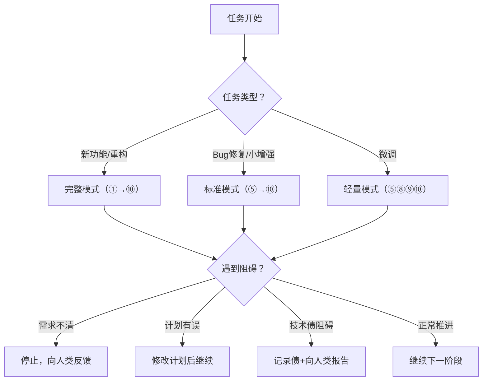
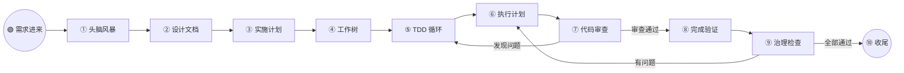
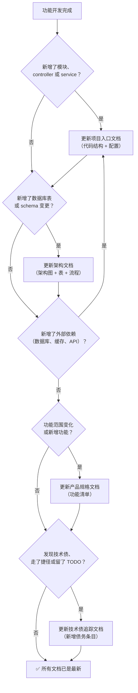

# 项目开发流程

## 概述

本项目遵循结构化开发流程，将项目治理与编码纪律结合。每个功能、bug 修复或实现任务都必须完整走完整个流程。

**核心原则：** 不走捷径。每个任务都必须跑完完整管线。

**启动时播报：** "开始 project-development-flow：[任务描述]"

## 模式选择

根据任务类型选择合适的流程模式：

| 模式 | 适用场景 | 执行阶段 |
|------|---------|---------|
| **完整模式** | 新功能开发、重大重构、架构变更 | 全部 10 个阶段 |
| **标准模式** | 已有明确方案的 bug 修复、小功能增强 | ⑤⑥⑦⑧⑨⑩（跳过 ①②③④） |
| **轻量模式** | 微调类改动（配置修改、文案修正、样式调整） | ⑤⑧⑨⑩（跳过 ①②③④⑥⑦） |

**模式选择规则：**
- 除非任务明显属于"标准"或"轻量"，否则默认走**完整模式**
- "标准模式"和"轻量模式"仍需在完成前通过阶段 ⑧⑨ 的质量门禁
- 不确定选哪个模式时，走完整模式

## 异常处理

当流程中出现以下情况时，按对应规则处理：

### 需求不清晰（阶段 1 头脑风暴中）

- 已问 3 个问题仍无法理解需求 → 停止，向人类伙伴反馈困惑点，等待澄清
- 人类伙伴给出的需求自相矛盾 → 列出矛盾点，请求确认
- 需求范围过大无法在一次开发中完成 → 拆分为多个独立任务，每个任务单独走流程

### 计划执行中发现问题（阶段 6 执行中）

- 发现计划步骤本身有误（文件路径不对、命令会失败等）→ **立即停止**，修改计划后再继续
- 发现需要额外步骤未在计划中 → 先补充到计划，再执行
- 发现和现有代码冲突 → 停止，分析冲突原因，向人类伙伴报告
- 单个任务耗时超过预估 3 倍 → 暂停，报告情况，请求指示

### 技术债阻碍功能完成（阶段 9 治理检查中）

- 发现必须先还债才能继续 → 记录到 tech-debt-tracker.md，向人类伙伴报告，由其决定是先还债还是带着债继续
- 技术债不影响当前功能但风险较高 → 记录并在收尾时提醒



## 流程管线



## 各阶段详解

### 阶段 1: 头脑风暴

**必须调用的子技能：** `superpowers:brainstorming`

- 一次问一个问题，理解需求意图
- 提出 2-3 个方案，附带取舍分析和推荐
- 每段 200-300 字，分段确认
- 严格执行 YAGNI（不需要的功能不写）

**例外：** 仅对微调类改动（改错别字、调配置）可跳过，但需要人类伙伴明确确认。

### 阶段 2: 编写设计文档

将确认后的设计方案保存为项目文档：

```
docs/plans/YYYY-MM-DD-<功能名>-design.md
```

提交到 git。

**设计文档模板：**

```markdown
# <功能名称> 设计文档

**日期：** YYYY-MM-DD
**作者：** <Agent / 人类>
**状态：** 草稿 / 已确认 / 已实施

## 背景
[为什么要做这个功能？解决了什么问题？]

## 需求描述
[功能的核心需求，用户场景]

## 方案选择

### 方案 A：<名称>
- 描述：
- 优点：
- 缺点：

### 方案 B：<名称>
- 描述：
- 优点：
- 缺点：

### 推荐方案
[选择哪个，为什么]

## 技术设计

### 涉及的文件变更
| 文件 | 变更类型 | 说明 |
|------|---------|------|
| `src/main/...` | 新增/修改 | ... |

### 数据库变更（如适用）
| 表名 | 变更类型 | 说明 |
|------|---------|------|

### API 变更（如适用）
| 方法 | 路径 | 说明 |
|------|------|------|

## 影响范围
[这个改动会影响哪些现有功能？]

## 风险和注意事项
[可能的风险点，需要特别注意的地方]
```

### 阶段 3: 编写实施计划

**必须调用的子技能：** `superpowers:writing-plans`

- 保存计划到 `docs/exec-plans/YYYY-MM-DD-<功能名>.md`
- 每个任务控制在 2-5 分钟内可完成
- 必须包含：精确的文件路径、完整代码、精确的命令及预期输出
- 每个任务遵循 TDD：写失败测试 → 看红 → 写代码 → 看绿 → 提交
- 计划头部必须包含：目标、架构、技术栈
- 计划头部必须引用 executing-plans 子技能以支持交接

**实施计划模板：**

```markdown
# <功能名称> 实施计划

**日期：** YYYY-MM-DD
**设计文档：** docs/plans/YYYY-MM-DD-<功能名>-design.md
**目标：** [一句话描述要实现什么]
**架构：** [涉及哪些层/服务/表]
**技术栈：** [用到的主要技术]

---

## 任务列表

### 任务 1: <任务名称>

**目标：** [这个任务完成后的预期状态]
**预计耗时：** X 分钟

**步骤：**
1. 创建测试文件（路径根据项目目录规范确定）
2. 写失败测试：
   // 测试代码
3. 运行测试命令（根据项目构建工具确定）
   - 预期：失败，报错信息为 ...
4. 实现代码：
   // 实现代码
5. 运行单个测试
   - 预期：全部通过
6. 运行全量测试
   - 预期：全部测试通过，输出干净
7. 提交：`git commit -m "feat: ..."

### 任务 2: <任务名称>
...（同上格式）
```

### 阶段 4: 创建工作树（可选）

**必须调用的子技能：** 需要隔离环境时使用 `superpowers:using-git-worktrees`

对于小修复或单次能完成的工作，跳过工作树，直接使用 feature branch。

### 阶段 5: TDD 循环

**必须调用的子技能：** `superpowers:test-driven-development`

**铁律：**
```
没有失败的测试，就不写生产代码
```

每个功能点的循环：
1. 🔴 **RED** — 写一个失败测试
2. 🔴 **验证 RED** — 跑测试，确认它因为正确的原因失败
3. 🟢 **GREEN** — 写最少的代码让测试通过
4. 🟢 **验证 GREEN** — 跑全部测试，确认都绿、输出干净
5. 🔧 **重构** — 在保持测试绿的前提下清理代码
6. 重复

**未经人类伙伴明确许可，不得跳过此阶段。**

### 阶段 6: 执行计划

**必须调用的子技能：** `superpowers:executing-plans`（批量执行）或 `superpowers:subagent-driven-development`（逐任务子代理）

- 每 3 个任务为一批执行
- 严格按计划步骤执行，不跳过验证
- 每批之间：报告进度，等待反馈
- 遇到阻碍立即停止，请求帮助

### 阶段 7: 代码审查

**必须调用的子技能：** `superpowers:requesting-code-review`

- 每个任务完成后审查（子代理模式）或每批完成后审查（批量执行模式）
- Critical 问题立即修复，Important 问题继续前修复完成，Minor 问题记录后续处理
- 如果审查意见不合理，用技术理由反驳——不盲从

### 阶段 8: 完成验证

**必须调用的子技能：** `superpowers:verification-before-completion`

**铁律：**
```
没有新鲜跑过的验证证据，就不能说"完成了"
```

声称任何任务完成之前：
1. 确定什么命令能证明它完成
2. 完整跑一遍该命令（全新的、完整的）
3. 读取完整输出，检查退出码
4. 确认输出和声明匹配
5. 然后才能说完成

**禁止说：** "应该没问题"、"大概可以了"、"看起来还行"。

### 阶段 9: 治理检查

运行项目治理检查，确保代码库在代码质量之外也保持健康。

**在收尾分支之前运行——这是合并/PR 之前的最后一道关卡。**

#### 9A: 代码质量检查（自动化）

运行项目配置的代码质量检查工具（如 Checkstyle、PMD、ESLint 等），所有检查必须 0 errors 才能继续。

如果项目有统一的检查脚本（如 `check-project.bat` 或 `npm run check`），优先使用统一脚本。

#### 9B: 项目文档更新（手动，每次功能开发后必须执行）

每次功能开发后，以下类型的文档必须被审查并视情况更新。这不是可选项——过时的文档比没有文档更糟糕。

| 文档类型 | 何时更新 | 更新内容 |
|---------|---------|---------|
| 项目入口文档（如 `AGENTS.md`） | 新增了模块、配置文件、外部依赖 | 添加：新包、新配置文件、新 controller/service |
| 架构文档（如 `ARCHITECTURE.md`） | 新增了层级、服务、数据库表、外部集成、设计模式变更 | 更新架构图，添加新服务/表，更新技术栈，更新核心流程 |
| 产品规格文档 | 新功能、功能范围变化、功能完成 | 更新功能清单状态，新增模块说明 |
| 技术债追踪文档 | 开发中发现技术债、走了捷径、留了 TODO | 新增条目，包含优先级、描述、修复建议。如已解决则更新状态。ID 编号规则请遵循项目已有约定 |
| 设计文档 | 阶段 2 创建的设计文档 | 应该已在阶段 2 生成，验证完整性 |
| 执行计划 | 阶段 3 创建的执行计划 | 应该已在阶段 3 生成，验证完整性 |

#### 9C: 文档完整性检查

- [ ] 项目入口文档中引用的所有文档仍然存在（无死链）
- [ ] 没有引入过时或无用的占位符文件
- [ ] 新文档遵循项目目录规范
- [ ] 文档之间没有断裂的交叉引用
- [ ] 项目入口文档中的代码结构树与实际源码目录结构一致

**任何检查失败：** 修复后再继续。不得在治理检查未通过时合并。

#### 文档更新决策流程图



### 阶段 10: 收尾分支

**必须调用的子技能：** `superpowers:finishing-a-development-branch`

- 先确认测试通过
- 运行项目配置的统一检查脚本 — 必须干净通过
- 给出 4 个选项：本地合并 / 创建 PR / 保持现状 / 丢弃
- 执行选中的选项
- 清理工作树（如适用）

## 快速参考

| 阶段 | 子技能 | 关键产出 |
|------|--------|---------|
| 1. 头脑风暴 | `superpowers:brainstorming` | 验证过的设计 |
| 2. 设计文档 | — | `docs/plans/YYYY-MM-DD-<名称>-design.md` |
| 3. 实施计划 | `superpowers:writing-plans` | `docs/exec-plans/YYYY-MM-DD-<名称>.md` |
| 4. 工作树 | `superpowers:using-git-worktrees` | 隔离的开发环境 |
| 5. TDD 循环 | `superpowers:test-driven-development` | 测试过的代码 |
| 6. 执行计划 | `superpowers:executing-plans` 或 `superpowers:subagent-driven-development` | 实现的功能 |
| 7. 代码审查 | `superpowers:requesting-code-review` | 审查通过的代码 |
| 8. 完成验证 | `superpowers:verification-before-completion` | 有证据的完成 |
| 9. 治理检查 | 项目配置的检查工具 + 文档完整性检查 | 治理验证通过 |
| 10. 收尾 | `superpowers:finishing-a-development-branch` | 合并/PR |

## 项目配置

以下内容因项目而异，请从项目的 `AGENTS.md` 或等效入口文档中读取，不要硬编码。

### 需要从项目中读取的信息

- **技术栈：** 语言版本、框架版本、构建工具
- **项目命令：** 构建、测试、打包、代码检查的具体命令
- **目录规范：** 源码、测试、文档、资源等目录结构
- **代码质量工具：** Checkstyle / ESLint / PMD 等配置和检查命令
- **提交风格：** Conventional Commits 或其他团队约定
- **质量门禁：** 项目定义的完成前必须通过的检查项

### 通用最佳实践

- 优先使用项目统一的检查脚本（如 `check-project.bat` 或 `npm run check`）
- 提交时使用 Conventional Commits 格式：`feat:`、`fix:`、`refactor:`、`docs:`、`test:`、`chore:`
- 每次测试循环通过后提交，优先小而聚焦的提交

## 常见错误

| 错误 | 修正 |
|------|------|
| 觉得"显而易见"就跳过头脑风暴 | 再简单的功能也有设计决策。始终头脑风暴。 |
| 先写代码再补测试 | 删掉代码，从 TDD 开始。 |
| 因为"之前测试通过"就跳过验证 | 全新运行测试套件。无例外。 |
| 执行超过 3 个任务不审查 | 每 3 个任务停下来审查，然后再继续。 |
| 合并后不跑测试就完事 | 合并后必须运行全量测试。 |
| 忽略代码质量工具的警告 | 修复所有错误才能声称完成。 |
| 跳过治理检查 | 合并前治理检查必须通过。无例外。 |
| 代码结构变了不更新文档 | 结构变更时同步更新架构文档和相关文档。 |
| 不记录技术债 | 添加到技术债追踪文档。 |

## 危险信号

**如果你脑海里出现以下想法，停下来重新审视：**
- "这个太简单了，不用走完整流程"
- "测试后面再补"
- "应该没问题，继续吧"
- "就这一次"
- "审查太过了"
- "代码质量检查警告无所谓"
- "治理检查是可选的"
- "文档以后再更新"

**以上任何一条都意味着：走完整流程。没有例外。**

## 项目治理集成

如果项目已建立治理规范（Harness Engineering），请遵循：

- 项目根目录有入口文档（如 `AGENTS.md`）— 首先阅读以获取项目上下文
- `docs/` 目录存放项目文档
- 项目有统一检查脚本用于治理检查
- 代码质量工具配置用于质量强制执行

如治理工件缺失或过时，在开始开发工作之前先运行治理审计。
